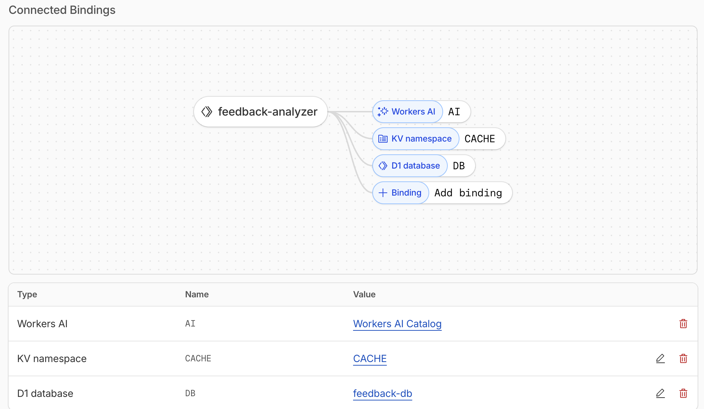

# Product Manager Intern (Summer 2026) Assignment - Lisbon

Candidate name: Paula Yaniz Macia

Demo URL: https://feedback-analyzer.pyaniz.workers.dev/

GitHub URL: https://github.com/PaulaYaniz/feedback-analyzer


# Cloudflare Product Friction Log

## Context
First time using Cloudflare Workers. I've only used Vercel before. Built a feedback aggregation tool with D1, KV, and Workers AI in about 2 hours.

## Insight 1

**Title:** Auth setup blocked me before writing any code

**Problem:** 

Ran `npm create cloudflare@latest`, project scaffolded fine. Then tried to create a D1 database:

```bash
$ npx wrangler d1 create feedback-db
🚫 Error: In a non-interactive environment, it's necessary 
to set a CLOUDFLARE_API_TOKEN environment variable.
```

Tried `wrangler login`. Browser opened, I authorized, saw "Success!"... same error. Spent 15 minutes googling. Eventually found out I needed an API token from the dashboard, but there were like 8 different token templates and no idea which one to use.

This was the first thing I tried to do after setup and it blocked me for 20 minutes.

**Suggestion:**

Make the error message actually helpful:

```bash
🚫 Authentication Error

For local development: wrangler login
For CI/CD: Set CLOUDFLARE_API_TOKEN
  (Get token: dash.cloudflare.com/profile/api-tokens)
```

Or even better: add auth to the initial setup flow:
```
✓ Project created
? Authenticate now? (Y/n)
  [Opens browser]
✓ Authenticated as john@example.com
```


## Insight 2

**Title:** If not with Claude, I would have had to manually copy-paste config for every binding

**Problem:**

Every time I created something (D1, KV, AI):
1. CLI creates resource and prints config
2. I manually open `wrangler.jsonc`
3. Figure out where to paste it
4. Copy the ID carefully
5. Hope I didn't typo anything

Claude and other AIs can automate, but without them, I was prone to errors. Made a mistake once—put D1 binding in the wrong spot and wasted 10 minutes debugging why local dev couldn't find my database.

The CLI has all the info it needs to update the config itself, so there should be a way for not doing it manually.

**Suggestion:**

Just ask me:

```bash
✓ Created DB 'feedback-db' (id: abc123...)

? Add to wrangler.jsonc? (Y/n) Y
✓ Updated wrangler.jsonc
```

Or add a `wrangler setup` command that creates all the resources at once and updates config automatically.


## Insight 3

**Title:** No idea what works locally VS what needs deployment

**Problem:**

Started `wrangler dev`, saw:
```
⎔ Bindings:
  - DB: feedback-db (local)
  - CACHE: CACHE (local)  
  - AI: workers-ai (remote)
```

Questions I had:
- Does "(remote)" mean AI won't work locally?
- Do I need to run migrations for local D1?

Tested my AI endpoint. Got 500 error. Deployed to prod to check. Worked fine there. I was not sure if AI worked locally.

Tried to add data to D1. `Error: no such table`. Found I needed to run migrations manually. Ended up deploying 8 times just to test stuff because I didn't trust local dev.

**Suggestion:**

Make startup more helpful:

```bash
⎔ Bindings:
  ✓ DB (D1) - Local SQLite
  ✓ CACHE (KV) - In-memory (not persisted)
  ⚠ AI - Remote (uses production, counts toward limits)

⚠ Found schema.sql but DB has no tables
  Run: wrangler d1 execute feedback-db --local --file=./schema.sql
  
? Run migrations now? (Y/n)
```

And maybe add `--mock-ai` flag so I can test without deploying:
```bash
$ wrangler dev --mock-ai
  ⚠ AI will return mock responses for faster testing
```


## Insight 4

**Title:** Which AI model should I use?

**Problem:**

Needed sentiment analysis. Docs showed 40+ models, and I had no idea which one to pick.

- `@cf/meta/llama-3-8b-instruct` - "language model for instruction-following"
- `@cf/huggingface/distilbert-sst-2-int8` - "sentiment classification"

DistilBERT sounded right so I used it. Got basic positive/negative labels. Wanted more detail so I switched to Llama. Better results but way slower. I did not know how much each costed or if I would hit rate limits.

It was difficult to find data to make actual decisions. It made it hard to balance cost, latency, and output quality, all important when taking a product decision.

**Suggestion:**

Add a recommendation tool:

```bash
$ wrangler ai recommend

What's your task?
> 1. Sentiment analysis

Recommended:

🏆 distilbert-sst-2-int8 
   Fast (~50ms), simple positive/negative labels

⚡ llama-3-8b-instruct
   Slower (~200ms), detailed analysis with custom prompts

Try: wrangler ai test distilbert-sst-2-int8 --input "I love this!"
```

Or add an AI playground in the dashboard where I can test models with my data before committing to code.


## Insight 5

**Title:** Docs organized by product, not by use case

**Problem:**

Cloudflare docs are thorough but organized by individual product (D1 docs, Workers docs, AI docs). When building my feedback tool, I needed to understand how they work together. I was switching tabs constantly. The docs assume I already know which products to combine.

**Suggestion:**

Add a "Guides" section with end-to-end examples:
- "Build a feedback aggregator with D1 + AI + KV"
- "Create a content moderation pipeline"
- "Set up semantic search with AI Search"

Show the architecture, explain why you'd pick each product, give working code that connects them.

AWS has this with "solution architectures." Vercel has great guides for specific app types. Cloudflare product docs are good but need more integration examples.

---
# Architecture Overview

## Cloudflare Products Used

### 1. Cloudflare Workers
Serverless compute platform that runs the entire application at the edge in 300+ cities worldwide. Workers hosts all API endpoints, AI orchestration logic, and dashboard HTML in a single codebase with low-latency response times suitable for interactive dashboards. Chose Workers because it eliminates server management, deploys with a single command, and provides native bindings to D1, Workers AI, and KV without external API calls. Workers provides the runtime and routing primitives, while caching and error handling are explicitly implemented in the Worker


### 2. D1 Database
SQLite database running at Cloudflare's edge that stores all feedback entries with metadata including source, text, sentiment, themes, urgency, and timestamps. Selected D1 for its familiar SQL syntax, low-latency reads from the nearest location, and serverless model that requires no database server management. The schema includes indexes, like sentiment and urgency, optimized for fast aggregation queries needed for PM analytics. 


### 3. Workers AI
On-platform AI inference service that analyzes feedback using the Llama-3-8b-instruct model to extract sentiment (positive/negative/neutral), themes (bug, feature-request, performance, UX, etc.), and urgency levels (low/medium/high). Chose Workers AI because the model runs directly on Cloudflare's network with no external API dependencies, keeping data private and latency low. Implemented lightweight parallel batch processing to analyze multiple feedback items concurrently, significantly reducing total analysis time. Simple per-request pricing with no API key management.


### 4. Workers KV
Global key-value storage that caches aggregated statistics and insights with 5-minute TTL to avoid recalculating on every request. KV provides sub-10ms reads from edge cache locations worldwide, materially reducing repeated D1 queries. Selected KV for its simple get/put API, automatic expiration support, and edge caching capabilities with the cacheTtl parameter (60s minimum). Metadata tracking on cached values includes timestamps, record counts, and version for debugging cache behavior.


## Why This Stack?

**Speed:** Built and deployed in 3.5 hours with no infrastructure setup.

**Performance:** Seconds-level AI analysis and sub-100ms cached responses.

**Cost-Effective:** Serverless pricing, no idle costs, free tier covers development.

**PM-Friendly:** Fast enough for real-time dashboards, smart enough for actionable insights.

**Integration:** Native bindings reduce integration overhead and configuration complexity.


## Data Flow

```
User Request → Cloudflare Workers
    ↓
Check KV Cache → HIT (10ms) or MISS
    ↓
Query D1 Database (with indexes)
    ↓
Analyze with Workers AI (parallel batches)
    ↓
Cache results in KV (5 min TTL)
    ↓
Return with Cache-Control headers
```


## Technical Details

**Optimizations Applied:**
- KV: cacheTtl (60s), metadata tracking
- Workers: Smart Placement enabled
- HTTP Cache-Control headers


## Bindings Screenshot




## Summary
Four Cloudflare products working together enable a globally-distributed, AI-powered feedback tool that runs fast (2-3s analysis), costs pennies, and scales automatically. The integrated platform eliminated the nedd for upfront infrastructure setup and third-party integrations.

---
# Vibe-Coding Prompts

**Platform Used:** Claude Code CLI (Anthropic) 
Note: Prompts evolved over time; examples below reflect representative prompts rather than a literal sequence. Some prompts were also crafted with the help of claude.ai and ChatGPT.


## Example Prompts

### Architecture & Setup
```
"Build a Cloudflare Worker-based feedback analytics system with D1 for storage, Workers AI for analysis, and KV for caching. Design for a PM use case. Prioritize actionable insights over raw data display."
```

### Performance Optimization
```
"The AI analysis is taking a long time. Implement parallel batch processing, process 5 items concurrently to reduce latency. Keep within Workers CPU limits."
```

### Product Features
```
"Transform this into a PM-centric dashboard with three tabs: Overview, Insights & Actions, and Detailed Feedback. The Insights tab should answer 'What should I do next?' with actionable recommendations, high-priority issues, most-requested features, and thematic analysis."
```

### AI Integration
```
"Design a Workers AI prompt for Llama-3-8b-instruct that extracts sentiment, themes, and urgency in a single API call. Return structured JSON with themes: bug, feature-request, performance, ux, documentation, pricing, security, integration."
```

### Best Practices Research
```
"Search Cloudflare documentation for D1 query optimization best practices, specifically around indexing and PRAGMA commands. I want official recommendations, not general advice. The documentation is currently open in my Chrome browser."
```

```
"Find Cloudflare's official guidance on KV cacheTtl parameter - what's the minimum value and what's the recommended pattern for frequently-read data?"
```

### Production Hardening
```
"Scan the official docs, which are open on my browser, and suggest low-effort improvements that make sense for a small Worker (not enterprise-scale). Explain tradeoffs briefly."
```

### Database Optimization
```
"Create a D1 schema optimized for PM analytics queries. Include indexes on source, sentiment, urgency, and created_at. Add PRAGMA optimize per Cloudflare best practices."
```

### Dashboard Development
```
"Build a clean, professional dashboard using JavaScript but no frameworks. Include stat cards, bar charts, tabbed interface, color-coded urgency indicators, and responsive design. Serve everything from the Worker."
```

### Iterative Refinement
```
"Current implementation works but is too slow for PM workflows. Three improvements: 1) Parallel AI processing to cut latency by 60%+, 2) Add Insights tab with actionable recommendations, 3) Filter and export capabilities. Maintain backward compatibility."
```


## Key Approach

Prompts were designed to be:
- **Outcome-focused** - Specified business goals, not just technical tasks
- **Constraint-driven** - Included platform limits and requirements
- **Measurable** - Defined concrete success criteria
- **Research-backed** - Referenced official Cloudflare documentation
- **Iterative** - Built incrementally: v1.0 foundation → v2.0 product value → v3.0 production readiness
